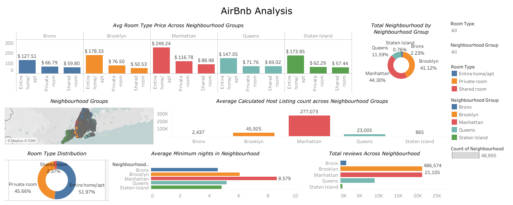
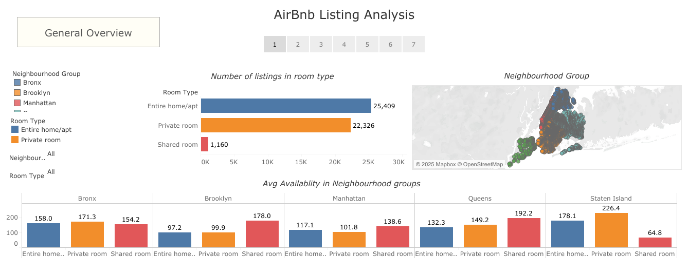
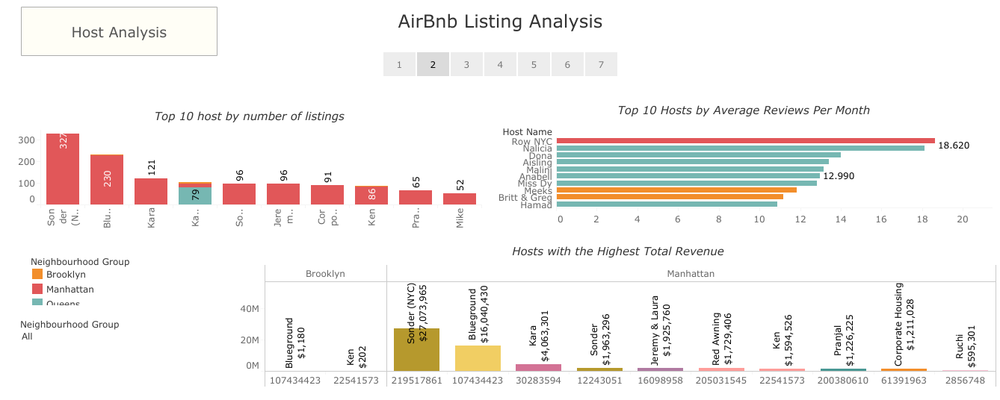
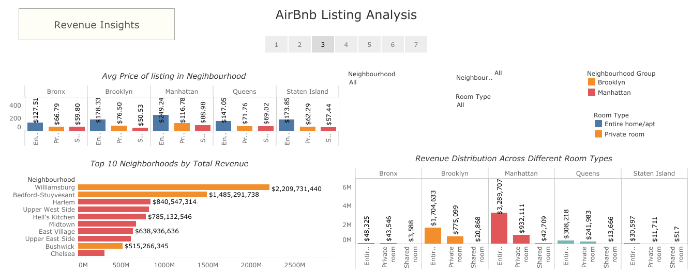
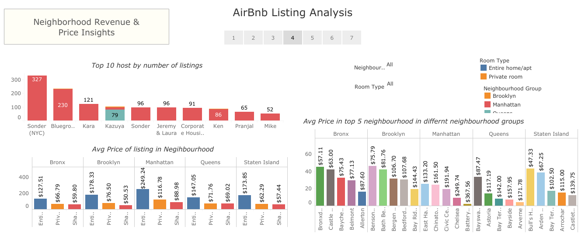
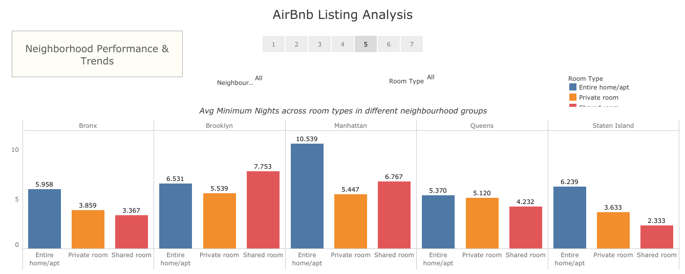
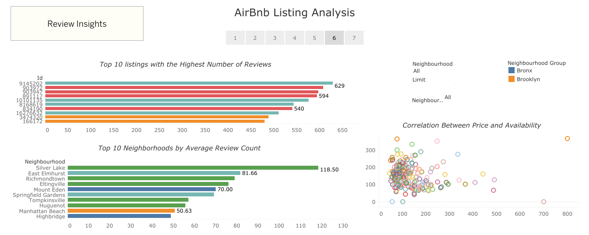
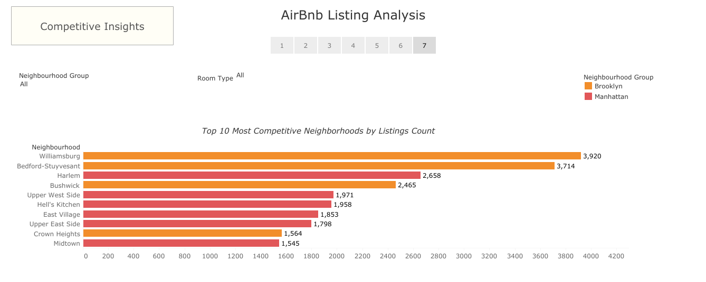

# Data Visualization | Airbnb NYC Analysis

Airbnb NYC listing Analysis using Tableau:

_Latest Dashboard:_  

DASHBOARD 1: 

_STORY: [set of dashboards (Categorized)](https://public.tableau.com/views/Book1_17386111231500/AirBnbListingAnalysis)_

-   Dashboard 1 \- General Overview
    

-   Dashboard 2 \- Host Analysis  
    

-   Dashboard 3 \- Pricing Trends
    

-   Dashboard 4, 5 \- Neighbourhood
    
    

-   Dashboard 6 \- Reviews  
    

-   Dashboard 7: Competitive Insights  
    
