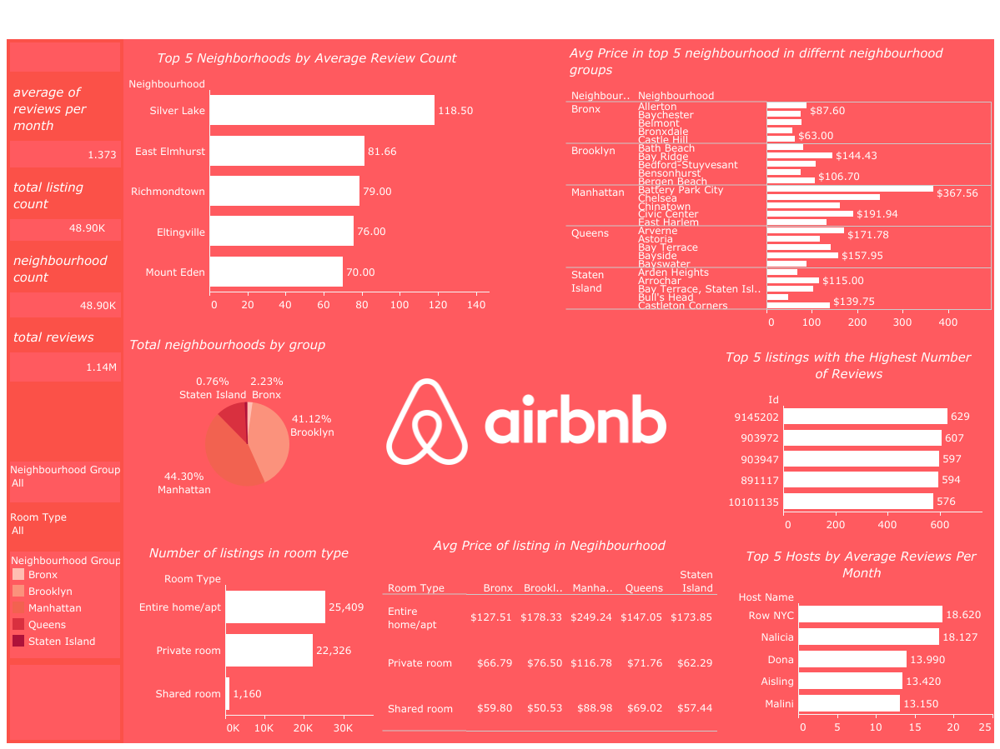

# Airbnb_nyc_analysis

**Project Summary: Analyzing Airbnb Listings in New York City**

**Overview:**
This project explores Airbnb listings in New York City to uncover patterns, trends, and insights that can enhance customer experience, optimize operational efficiency, and drive strategic business decisions. The dataset includes 48,895 records across 16 columns, offering a mix of categorical and numerical features related to Airbnb listings in NYC.

**Business Context:**
Airbnb, founded in 2008, has revolutionized travel by offering guests unique and personalized accommodations through its platform. Data analysis of Airbnb listings is crucial for improving the platform's offerings, understanding customer behavior, optimizing pricing strategies, and guiding marketing initiatives. This dataset contains 48,895 listings with information on location, room type, pricing, reviews, and host details, providing valuable insights into New York City's Airbnb landscape.

**Data Overview:**

-   The dataset consists of 48,895 listings and 16 columns, including:
    -   `id`, `name`, `host_id`, `host_name`, `neighbourhood_group`, `room_type`, `price`, `minimum_nights`, `number_of_reviews`, and others.
    -   **Missing Values**: 20,141 missing values (2.57% of the dataset), primarily in `last_review` and `reviews_per_month`.
    -   **Data Types**: Mix of `int64`, `float64`, and `object`.

**Key Insights & Findings:**

1. **Listing Distribution by Neighborhood**:

    - Listings are highly concentrated in Brooklyn (18,272 listings) and Manhattan (17,784 listings), representing over 70% of the total dataset.
    - Other neighborhoods like Queens (4,695) and the Bronx (970) have fewer listings.

2. **Room Type Distribution**:

    - **Entire homes/apartments** dominate in Manhattan (10,400 listings) and Brooklyn (9,017 listings).
    - **Private rooms** are most common in Brooklyn (9,024) and Manhattan (7,028).
    - Staten Island has the fewest listings, with a significant portion being **private rooms**.

3. **Average Price by Room Type & Neighborhood**:

    - **Entire homes/apartments** are the most expensive across all neighborhoods, with Manhattan listings averaging $189.38, significantly higher than other areas.
    - **Private rooms** are more affordable, averaging around $90 in Manhattan and $65 in Brooklyn.
    - **Shared rooms** tend to be the least expensive, especially in the Bronx and Queens.

4. **Average Reviews per Listing**:

    - **Staten Island** has the highest average number of reviews per listing (2.6), suggesting a more engaged audience.
    - **Manhattan** and **Brooklyn** show lower average reviews per listing (1.9–2.3), which may indicate more listings with fewer reviews.

5. **Host Performance**:

    - Top hosts, such as **Marcelo Y Lucio** and **The Broome Hotel**, manage up to 4 listings each.
    - Some hosts have accumulated impressive total reviews, with **Jason** receiving the highest at 21,579 reviews.

6. **Room Type Popularity**:

    - **Entire homes/apartments** are the most popular, with 21,853 listings, followed by **private rooms** (19,424 listings).
    - **Shared rooms** represent a small fraction of the dataset (754 listings).

7. **Outliers & Data Transformation**:
    - Outliers were identified and separated for further analysis, ensuring data integrity.
    - Log and square root transformations were applied to highly skewed data, such as `price` and `minimum_nights`, to stabilize variance and improve model performance.
    - To make visualizations more interpretable, the transformed data was reverted back to its original scale using `np.expm1`.

**Challenges Addressed:**

-   Handling missing data: Imputed missing values where necessary to ensure a complete analysis.
-   Dealing with skewed data: Applied appropriate transformations to normalize highly skewed variables like price.
-   Outlier analysis: Isolated outliers to avoid skewing analysis results and preserve data integrity.

**Conclusion:**
This analysis provides a comprehensive understanding of Airbnb's NYC listings, offering valuable insights into pricing trends, neighborhood distributions, room types, and host performance. The findings can help Airbnb optimize operations, adjust pricing strategies, and enhance the customer experience on the platform. By leveraging data-driven insights, Airbnb can make informed decisions that align with user preferences and market demand.
